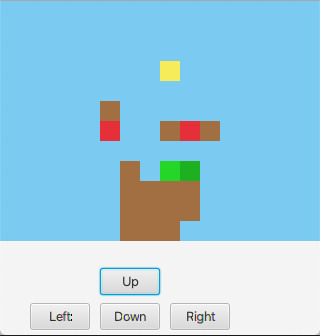
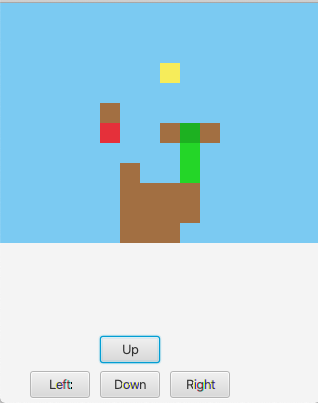

# Øvingsforelesning 5    

**Læringsmål:**
- Lære å lage Java programmer hvor flere klasser jobber sammen 
    
## Oppgaver

I denne oppgaven skal vi lage en simplifisert tekstbasert versjon av spillet [Snakebird](https://store.steampowered.com/app/357300/Snakebird/). Versjon vil lager i dag, vil kreve at vi skriver kode for hver bevegelse vi gjør. I neste øvingsforelesning vil vi jobbe videre med koden vår, og lage en grafisk versjon ved hjelp av JavaFX, slik som kan ses i bildet under.



**Hvordan fungerer Snakebird**

I Snakebird er du en slange som ønsker å komme deg i mål (den gule firkanten). Du kan bevege deg opp og ned, samt til høyre og venstre i forhold til hodet (den mørkegrønne firkanten). Kroppen følger da etter ved at hodet flytter seg til neste posisjon og de andre blokken flytter seg til der blokken før dem i slangen fantes før forflytning. Deler av slangen kan henge i luften uten å ha noe under seg, men hvis hele slangen henger i luften faller den ned. På brettet finnes det noe frukt (røde firkanter), når du spiser frukt, vil slangen bli en blokk lengre. Det er mulig å bevege seg slik at slangen sitter fast, og ikke kan bevege seg noen vei. Dette kan for eksempel skje fra posisjonen på bildet over, hvor etter å ha beveget seg opp to ganger, vil slangen sitte fast (se bilde under). Her kan man ikke bevege seg til høyre, venstre eller ned. Og hvis man beveger seg opp, vil hele slangen være i luften og dermed falle ned.



**Utdelt kode**
Til denne oppgaven er det delt ut en klasse kalt **Tile**. Denne klassen er ment å representere en posisjon i brettet og tar vare på sitt koordinat (**x** og **y**), samt hva slags type blokk den er.

*For disse oppgavene er det bare å skriv koden din i pakken med navn "kode".*

#### a)

Med koden i **Tile** klassen har vi allerede en måte å representere hver posisjon eller blokk på brettet. Det neste vi trenger er en måte representere brettet på. Til dette trenger vi en ny klasse.

**Lag en klasse "Game". Game skal ha en konstruktør som tar inn høyde og bredde på brettet og lager et brett med kun luft. Det skal også være mulig å hente ut blokker (Tile-objekter) fra brettet ved å kalle en funskjon med koordinatene til blokken (x, y) som argumenter.**

*Tips: Det kan være smart å lage en funksjon som tar inn et koordinat (to verdier, x og y), og sjekker om dette koordinatet er innenfor eller utenfor brettet.*  

#### b)

For å kunne ha et tekstbasert spill må det være mulig å se nåværende status.

**Lag en toString metode for Game som gir ut en tekststreng som representerer spillebrettet.**

*Tips: Det kan være smart å lage en toString metode for Tile og bruke denne i Game*

Følgende **main**-metode skal skrive ut en tekstrepresentasjon av brettet i bildene over.

```
public static void main(String[] args) {
    Game game = new Game(16, 12);
    game.getTile(6, 11).setGround();
    game.getTile(7, 11).setGround();
    game.getTile(8, 11).setGround();
    game.getTile(6, 10).setGround();
    game.getTile(7, 10).setGround();
    game.getTile(8, 10).setGround();
    game.getTile(9, 10).setGround();
    game.getTile(6, 9).setGround();
    game.getTile(7, 9).setGround();
    game.getTile(8, 9).setGround();
    game.getTile(9, 9).setGround();
    game.getTile(6, 8).setGround();
    game.getTile(8, 6).setGround();
    game.getTile(10, 6).setGround();
    game.getTile(5, 5).setGround();
    game.getTile(5, 6).setFruit();
    game.getTile(9, 6).setFruit();
    game.getTile(8, 3).setGoal();
    game.getTile(9, 8).setSnake();
    game.getTile(8, 8).setSnake();

    System.out.println(game);
}
```

#### c)

I **main**-metoden over lager vi slangen med å kalle **setSnake** metoden på blokkene, slik at brettet skal se riktig ut. Problemet med å gjøre det på denne måten er at Game klassen ikke enkelt vet hvor slangen er, og ikke kan vite rekkefølgen på blokken i slangen.

**Lag en funksjon som tar inn en liste av Tile-objekter som representerer slangen. Objektene ligger i listen i den rekkefølgen de opptrer i slangen (fra hode til hale), hvor hode er på indeks 0. Du kan anta at Tile-objektene er slik at slangen blir sammenhengende og at de ikke er repeterende.**

*Tips 1: Husk å oppdatere hvilken type blokk Tile-objektene er.*

*Tips 2: Du står fritt til å velge måte å representere slangen på internt, men en lignende måte til den som brukes for argumentene i denne funksjonen kan anbefales.*

*Tips 3: Det kan være smart å oppdatere toString metoden i Game for å endre tegn på hodet til slangen.*


Følgende **main**-metode burde skrive ut en samme tekstrepresentasjon av brettet som i oppgave b).

```
public static void main(String[] args) {
    Game game = new Game(16, 12);
    game.getTile(6, 11).setGround();
    game.getTile(7, 11).setGround();
    game.getTile(8, 11).setGround();
    game.getTile(6, 10).setGround();
    game.getTile(7, 10).setGround();
    game.getTile(8, 10).setGround();
    game.getTile(9, 10).setGround();
    game.getTile(6, 9).setGround();
    game.getTile(7, 9).setGround();
    game.getTile(8, 9).setGround();
    game.getTile(9, 9).setGround();
    game.getTile(6, 8).setGround();
    game.getTile(8, 6).setGround();
    game.getTile(10, 6).setGround();
    game.getTile(5, 5).setGround();
    game.getTile(5, 6).setFruit();
    game.getTile(9, 6).setFruit();
    game.getTile(8, 3).setGoal();

    game.createSnake(Arrays.asList(game.getTile(9, 8), game.getTile(8, 8)));

    System.out.println(game);
}
```

#### d)

Vi har nå en representasjon av brettet, men spillet vårt gjør enda ingenting. Det viktigste i spillet er bevegelse av slangen.

**Lag metoder for å bevege slangen. Du trenger ikke å tenke på frukt, mål eller fall, og kan anta at du kan bevege deg til en blokk hvis den enten er luft eller halen din (siden halen beveger seg vekk).**

*Tips 1: Det kan være smart å lage en intern (private) hjelpemetode for bevegelse, som tar inn endring i x og y koordinat, og ha offentlige metoder for hver av bevegelsene (opp, ned, venstre, høyre) som kaller denne.*

*Tips 2: Husk å oppdatere hvilke blokker som er slange og hvilke som er luft.*

Følgende **main**-metode skal ved riktig implementasjon bevege slangen i en sirkel (hvis ikke du har tatt høyde for fall).

```
public static void main(String[] args) {
    Game game = new Game(16, 12);
    game.getTile(6, 11).setGround();
    game.getTile(7, 11).setGround();
    game.getTile(8, 11).setGround();
    game.getTile(6, 10).setGround();
    game.getTile(7, 10).setGround();
    game.getTile(8, 10).setGround();
    game.getTile(9, 10).setGround();
    game.getTile(6, 9).setGround();
    game.getTile(7, 9).setGround();
    game.getTile(8, 9).setGround();
    game.getTile(9, 9).setGround();
    game.getTile(6, 8).setGround();
    game.getTile(8, 6).setGround();
    game.getTile(10, 6).setGround();
    game.getTile(5, 5).setGround();
    game.getTile(5, 6).setFruit();
    game.getTile(9, 6).setFruit();
    game.getTile(8, 3).setGoal();

    game.createSnake(Arrays.asList(game.getTile(9, 8), game.getTile(8, 8)));

    System.out.println(game);
    game.moveUp();
    System.out.println(game);
    game.moveLeft();
    System.out.println(game);
    game.moveUp();
    System.out.println(game);
    game.moveDown();
    System.out.println(game);
    game.moveDown();
    System.out.println(game);
    game.moveRight();
    System.out.println(game);
}
```

#### e)

Neste steg er å implementere funksjonaliteten til frukt.

**Endre metoden(e) for bevegelse slik at det er mulig å bevege seg over frukt. Frukten skal da bli borte og slangen skal bli en blokk lengre. Den nye blokken i slangen skal oppstå der halen var før bevegelsen som tok slangen til frukten.**

Følgende **main**-metode skal ved riktig implementasjon spise den ene frukten og gjøre slangen 3 blokker lang.

```
public static void main(String[] args) {
    Game game = new Game(16, 12);
    game.getTile(6, 11).setGround();
    game.getTile(7, 11).setGround();
    game.getTile(8, 11).setGround();
    game.getTile(6, 10).setGround();
    game.getTile(7, 10).setGround();
    game.getTile(8, 10).setGround();
    game.getTile(9, 10).setGround();
    game.getTile(6, 9).setGround();
    game.getTile(7, 9).setGround();
    game.getTile(8, 9).setGround();
    game.getTile(9, 9).setGround();
    game.getTile(6, 8).setGround();
    game.getTile(8, 6).setGround();
    game.getTile(10, 6).setGround();
    game.getTile(5, 5).setGround();
    game.getTile(5, 6).setFruit();
    game.getTile(9, 6).setFruit();
    game.getTile(8, 3).setGoal();

    game.createSnake(Arrays.asList(game.getTile(9, 8), game.getTile(8, 8)));

    System.out.println(game);
    game.moveUp();
    System.out.println(game);
    game.moveUp();
    System.out.println(game);
}
```

#### f)

Slangen vår kan nå spise frukt. Men vi mangler fortsatt å implementere muligheten for å falle.

**Endre metoden(e) for bevegelse slik at hvis slangen står i løse luften etter å ha bevegd seg, faller den ned helt til minst en av delene har bakke under seg. Hvis slangen kommer til å falle ut av brettet, er spillet over og det skal ikke være mulig å bevege seg.**

*Tips: Det kan være smart å oppdatere toString metoden til å legge til en beskjed hvis spillet er over.*

Følgende **main**-metode skal ved riktig implementasjon sende slangen utenfor brettet og spillet skal være over.

```
public static void main(String[] args) {
    Game game = new Game(16, 12);
    game.getTile(6, 11).setGround();
    game.getTile(7, 11).setGround();
    game.getTile(8, 11).setGround();
    game.getTile(6, 10).setGround();
    game.getTile(7, 10).setGround();
    game.getTile(8, 10).setGround();
    game.getTile(9, 10).setGround();
    game.getTile(6, 9).setGround();
    game.getTile(7, 9).setGround();
    game.getTile(8, 9).setGround();
    game.getTile(9, 9).setGround();
    game.getTile(6, 8).setGround();
    game.getTile(8, 6).setGround();
    game.getTile(10, 6).setGround();
    game.getTile(5, 5).setGround();
    game.getTile(5, 6).setFruit();
    game.getTile(9, 6).setFruit();
    game.getTile(8, 3).setGoal();

    game.createSnake(Arrays.asList(game.getTile(9, 8), game.getTile(8, 8)));

    System.out.println(game);
    game.moveRight();
    System.out.println(game);
    game.moveRight();
    System.out.println(game);
}
```

#### g)

Nå fungerer alt i spillet vårt, med unntak av det å vinne spillet.

**Endre metoden(e) for bevegelse til å sjekke om slangen kommer til å bevege seg på et mål, og i så tilfelle sett spillet til å være vunnet. Etter at slangen har kommet seg på et mål, skal det ikke være mulig å bevege seg lengre. Slangen skal heller ikke kunne falle ned.**

*Tips: Det kan være smart å endre toString metoden til å legge til en beskjed hvis spillet er vunnet*

Følgende **main**-metode skal ved riktig implementasjon hente all frukten og gå i mål.

```
public static void main(String[] args) {
    Game game = new Game(16, 12);
    game.getTile(6, 11).setGround();
    game.getTile(7, 11).setGround();
    game.getTile(8, 11).setGround();
    game.getTile(6, 10).setGround();
    game.getTile(7, 10).setGround();
    game.getTile(8, 10).setGround();
    game.getTile(9, 10).setGround();
    game.getTile(6, 9).setGround();
    game.getTile(7, 9).setGround();
    game.getTile(8, 9).setGround();
    game.getTile(9, 9).setGround();
    game.getTile(6, 8).setGround();
    game.getTile(8, 6).setGround();
    game.getTile(10, 6).setGround();
    game.getTile(5, 5).setGround();
    game.getTile(5, 6).setFruit();
    game.getTile(9, 6).setFruit();
    game.getTile(8, 3).setGoal();

    game.createSnake(Arrays.asList(game.getTile(9, 8), game.getTile(8, 8)));

    game.moveUp();
    System.out.println(game);
    game.moveLeft();
    System.out.println(game);
    game.moveLeft();
    System.out.println(game);
    game.moveUp();
    System.out.println(game);
    game.moveLeft();
    System.out.println(game);
    game.moveLeft();
    System.out.println(game);
    game.moveUp();
    System.out.println(game);
    game.moveRight();
    System.out.println(game);
    game.moveRight();
    System.out.println(game);
    game.moveRight();
    System.out.println(game);
    game.moveRight();
    System.out.println(game);
    game.moveUp();
    System.out.println(game);
    game.moveUp();
    System.out.println(game);
    game.moveUp();
    System.out.println(game);
    game.moveLeft();
    System.out.println(game);
    game.moveUp();
    System.out.println(game);
    game.moveUp();
    System.out.println(game);
}
```


