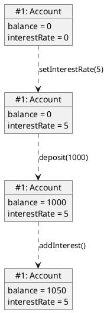
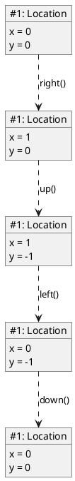
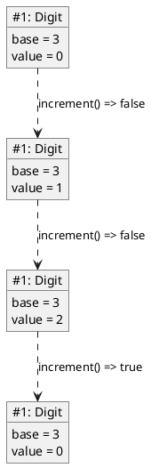
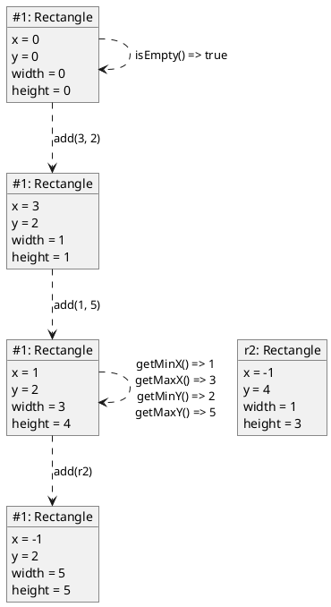
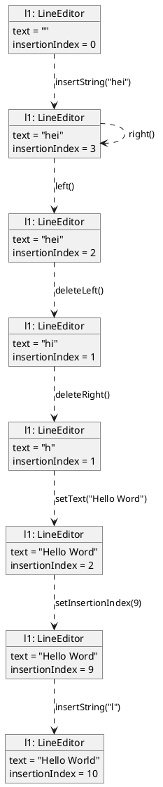
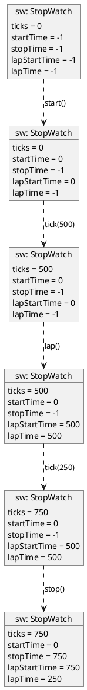

# Diagrammer for Øving 1
Dette er eksempeldiagrammer for øving 1. Merk at man står fri til å velge kall-sekvenser selv, så dette er bare eksempler og ikke eneste fasit.

## Account

## Location

## Digit

## Rectangle

## LineEditor

## Stopwatch

