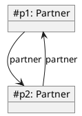
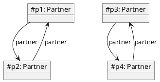
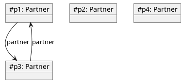

# Objektstrukturer - Partner-oppgave

Denne oppgaven handler om en `Partner`-klasse med en [1-1-assosiasjon](https://www.ntnu.no/wiki/display/tdt4100/Koding+av+1-1-assosiasjoner)
kalt partner tilbake til samme klasse (altså kjønnsnøytralt partnerskap)
og det å sikre konsistens, slik at Partner-objekter er parvis knyttet sammen.

En viktig del av det å implementere assosiasjoner er å sikre konsistens, dvs. at objekter i hver ende av en kobling refererer korrekt til
hverandre. Et eksempel på dette for [1-1-assosiasjoner](https://www.ntnu.no/wiki/display/tdt4100/Koding+av+1-1-assosiasjoner) er
(kjønnsnøytralt) partnerskap, hvor to partnere er koblet til hverandre når partnerskap
inngås og kobles fra hverandre ved en evt. skillsmisse. I denne oppgaven skal en `Partner`-klasse implementeres og ulike situasjoner håndteres
korrekt, som illustrert nedenfor.

`Partner`-klassen skal inneholde informasjon om *navn* (en String), som bare skal kunne settes i konstruktøren, og *partneren*, som er et annet
Partner-objekt. Navnet er ikke viktig for oppførselen, men er grei å ha med i en `toString()`-metode, for å skille Partner-objektene fra
hverandre. `Partner`-klassen skal ha følgende metoder for å lese tilstanden:

* `getName()` - returnerer navnet knyttet til dette Partner-objektet
* `getPartner()` - returnerer Partner-objektet som er knyttet til dette Partner-objektet, evt. null, hvis partnerskap ikke er inngått

`Partner`-klassen har kun én endringsmetode, `setPartner(Partner)`, som brukes både for å inngå partnerskap, når argumentet er et Partner-objekt,
og oppløse det, når argumentet er null. List og figurene under illustrerer de tre tilfellene som må kunne håndteres, og som JUnit-testene sjekker.

### 1. Inngåelse av partnerskap:
**Kall**: p1.setPartner(p2)

**Beskrivlse**: Partner-objektene p1 og p2 kobles sammen med ett kall til setPartner. Før kallet er p1 og p2 ikke koblet sammen,
og etter kallet er det koblet sammen.

**Før kall**:

**Etter kall**:

### 2. Oppløsning av partnerskap:
**Kall**: p1.setPartner(null)

**Beskrivlse**: Partner-objektene p1 og p2 kobles fra hverandre med ett kall til setPartner med null som argument.
Før kallet er p1 og p2 koblet sammen, og etter kallet er det ikke lenger koblet sammen.

**Før kall**:

**Etter kall**:

### 3. Oppløsning og inngåelse av partnerskap i ett:
**Kall**: p1.setPartner(p3)

**Beskrivlse**: Partner-objektene p1, p2, p3 og p4 er parvis koblet sammen, før ett kall til setPartner kobler
sammen p1 og p3, mens p2 og p4 kobles fra deres tidligere partnere.

**Før kall**:

**Etter kall**:

## Gjøremål
Oppgaven er (enkelt og greit) å implementere `Partner`-klassen og sjekke (f.eks. med en `main`-metode) at Partner-objektene oppfører seg som de skal.

## Exercise-panelet
Bruk av Exercise-panelet er obligatorisk for denne oppgaven. Du må ha panelet åpent med `Partner.ex`-filen (`tests > objectstructures > Partner.ex`) i før du begynner med oppgaven. For mer informasjon/hjelp, se nederst på hovedsiden for Øving 5.
